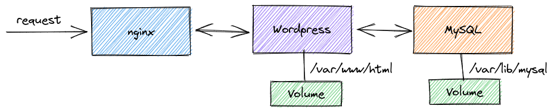

# 事前課題

## 1. Docker イメージを Push する

Docker イメージを Build してレジストリ(Docker Hub)に Push してください。  
また、Push したイメージを Pull してコンテナを実行してください。

Build するイメージはどのようなものでも構いません。ただし、Public で公開する場合は機密情報を含まないように注意してください。

## 2. WordPress を docker-compose で起動する

次のような構成で WordPress を docker-compose で起動してください。

- データベースに MySQL を使うこと
- WordPress と MySQL のデータは永続化(コンテナを再起動してもデータは保持)されるように volume を作成すること
    - WordPress は `/var/www/html` を永続化
    - MySQL は `/var/lib/mysql` を永続化
- WordPress へのアクセスには nginx のリバースプロキシを通すこと

