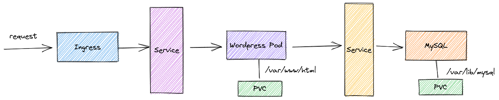

# 事前課題

## 1. 自分で作ったコンテナイメージを Pod として起動する

「[Docker 事前課題 1. Docker イメージを Push する](../docker/challenge.md)」で作ったコンテナイメージを使った Pod を起動してください。Pod でも Deployment でも構いません。

## 2. WordPress をデプロイする

次のような構成で WordPress を Kubernetes 上にデプロイしてください。

- データベースに MySQL を使うこと
    - パスワードは Secrets リソースで扱うこと
    - `/var/lib/mysql` は PVC で永続化すること
- WordPress のデータ `/var/www/html` は PVC で永続化すること
- WordPress に Ingress 経由でアクセスできること

