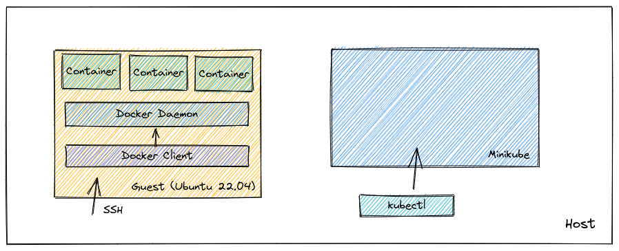

# 構築する環境

次の2つを手元の端末にセットアップしてください。ホストとなる OS は Windows / Mac(Intel) / Linux であれば構いません。

- [Docker Host(Linux VM)](./docker.md)
- [Minikube](./kubernetes.md)

## Docker Host (Linux VM)

Docker の演習などを行うホストです。コンテナを構成する要素技術についても触れるため、Docker Dekstop などではなく、Linux の仮想環境(VM)を用意してください。  
ホスト OS から SSH などを使って操作することを想定します。

## Minukube

Kubernetes の演習環境です。ホスト上に VM を構築し、シングルノードの Kubernetes クラスタを構築します。  
ホスト OS から `kubectl` で Kubernetes クラスタを操作することを想定します。  
